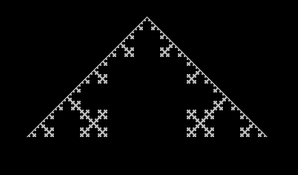
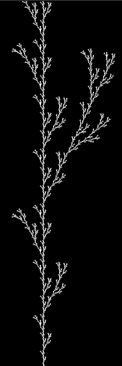
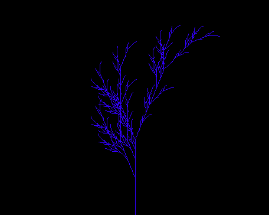

# L-System Viewer

L-System Viewer is an application for viewing simple edge and node based l-systems.

It can load configuration files from disk, and present various iterations to the user.

## What it does

Currently, the program will load in a specific file, and its adjacent '.rules' file and present it at a static length
to the user.

The l-system works as expected for edge and node based rules, though there are discrepancies with certain types of fractals.

## What you will need to build/run it

- SDL2
- Linux (Should also work on Mac and Windows, but only tested on Linux)
- GCC/G++ (You can just edit the Makefile if you use another compiler)

## Using the application

The application will start with a black screen. This is correct behaviour.

Pressing the 'A' key will begin the programming at which point the following controls are possible:

- 'A' - Advance to the next L-System
- 'C' - Change the colour of the L-System
- '1-5' - These keys will update the iteration of the current L-System

NOTE: Each L-System is completely independent of the others. Changing the colours of one, will not change the colours of the rest, etc...

## Example Screenshots

## Known issues

- There is no title / splash screen at startup
- The output can be a bit noisy at shorted lengths
- Certain values are static and cannot be adjusted unless edits are made via code
- There is no UI and no feedback for the user
- There is no way to save output from the program
- If any key other than the ones listed in the 'Using the application' section are pressed, the screen will go black. Simply press one of assigned keys again to restore visuals.
